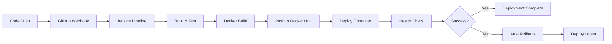

# Hello Node Docker Application

A simple Node.js Express application containerized with Docker, featuring automated CI/CD deployment through Jenkins pipelines with comprehensive rollback capabilities.

## 🚀 Overview

This application demonstrates a complete DevOps workflow with:
- **Node.js Express web server** serving dynamic content
- **Docker containerization** with health checks
- **Jenkins CI/CD pipeline integration** with automated deployment
- **Parameterized rollback capabilities** for quick version management
- **GitHub webhook integration** for automated builds
- **Docker Hub integration** for image registry management

## 📋 Application Details

- **Framework:** Node.js with Express.js
- **Current Version:** 2.3
- **Port:** 3000
- **Health Check:** Built-in Docker health monitoring with curl
- **Image Repository:** `bhaktabhusandas/hello-node-app`

## 📁 Repository Structure

```
.
├── app.js                    # Main Express application file
├── package.json              # Node.js dependencies and scripts
├── package-lock.json         # Locked dependency versions
├── Dockerfile               # Multi-stage container configuration
├── Jenkinsfile              # Main CI/CD deployment pipeline
├── RollbackJenkinsfile      # Parameterized rollback pipeline
├── .dockerignore            # Docker build exclusions
├── .gitignore              # Git version control exclusions
└── node_modules/            # NPM dependencies (not tracked)
```

## 🛠️ Local Development

### Prerequisites
- Node.js (v16 or later)
- npm package manager
- Docker (optional for containerization)

### Setup and Run

1. **Clone the repository:**
   ```bash
   git clone https://github.com/BhaktaBhusanDas/hello-node-docker.git
   cd hello-node-docker
   ```

2. **Install dependencies:**
   ```bash
   npm install
   ```

3. **Run locally:**
   ```bash
   npm start
   ```

4. **Access application:**
   ```
   http://localhost:3000
   ```

The application will display: *"Hello world from dockerized Node.js App Version: 2.3"*

## 🐳 Docker Usage

### Building and Running Locally

1. **Build Docker image:**
   ```bash
   docker build -t hello-node-app .
   ```

2. **Run container:**
   ```bash
   docker run -d -p 3000:3000 --name hello-node-app hello-node-app
   ```

3. **Check health status:**
   ```bash
   docker ps
   # Look for (healthy) status
   ```

4. **View logs:**
   ```bash
   docker logs hello-node-app
   ```

### Docker Image Features

- **Base Image:** `node:16-alpine` for minimal footprint
- **Production Dependencies:** Only production npm packages installed
- **Health Checks:** Automatic container health monitoring every 30 seconds
- **Port Exposure:** Container exposes port 3000
- **Working Directory:** `/usr/src/app`

## 🔄 CI/CD Pipeline Features

### Main Deployment Pipeline (Jenkinsfile)

**Triggers:** Automated builds via GitHub webhooks

**Pipeline Stages:**
1. **Checkout:** Clone source code from GitHub main branch
2. **Build Application:** Install npm dependencies
3. **Build Docker Image:** Create tagged Docker image (`bhaktabhusandas/hello-node-app:BUILD_NUMBER`)
4. **Push Docker Image:** Push to Docker Hub with build number and latest tags
5. **Deploy To Server:** Deploy container with health checks and automatic rollback on failure

**Key Features:**
- **Automated Tagging:** Each build gets unique BUILD_NUMBER tag
- **Dual Tagging:** Images tagged with both BUILD_NUMBER and 'latest'
- **Health Monitoring:** Built-in container health checks
- **Automatic Rollback:** Falls back to 'latest' tag on deployment failure
- **Container Management:** Stops and removes previous containers before deployment

**Environment Variables:**
```groovy
DOCKER_CREDENTIALS = 'docker-hub-creds'
IMAGE_NAME = "bhaktabhusandas/hello-node-app"
IMAGE_TAG = "${env.BUILD_NUMBER}"
```

### Rollback Pipeline (RollbackJenkinsfile)

**Purpose:** Quick rollback to any previous application version

**Parameters:**
- **VERSION:** Select version to roll back to (1, 2, 3)
- **CONTAINER_NAME:** Name of container to rollback (default: hello-node-app)
- **IMAGE_REPO:** Docker repository name (default: bhaktabhusandas/hello-node-app)
- **HOST_PORT:** Host port to expose (default: 3000)
- **CONTAINER_PORT:** Container internal port (default: 3000)

**Pipeline Stages:**
1. **Validate Parameters:** Display rollback configuration
2. **Stop Current Container:** Gracefully stop and remove running container
3. **Pull Previous Version:** Download specified version from Docker Hub
4. **Deploy Previous Version:** Start container with specified version
5. **Verify Rollback:** Health checks and container status verification

**Usage Example:**
```bash
# Trigger rollback pipeline with parameters:
# VERSION: "2"
# CONTAINER_NAME: "hello-node-app"
# Rolls back to version 2 of the application
```

## 🔗 Infrastructure Integration

This application is designed to work seamlessly with the [JenkinsSetupUsingTerraform](https://github.com/BhaktaBhusanDas/JenkinsSetupUsingTerraform) project, which provides:

- **Automated Jenkins Server Provisioning** on AWS EC2
- **Pipeline Job Creation** via Jenkins Configuration as Code (JCasC)
- **GitHub Webhook Management** with automatic IP updates
- **Docker Hub Credential Automation** for secure image pushes
- **Security Group Configuration** for ports 22, 80, 3000, 8080

## 📊 Deployment Workflow



## 🛡️ Security Features

- **Production Dependencies Only:** Docker image contains only production npm packages
- **Non-root User:** Container runs with restricted permissions
- **Health Monitoring:** Continuous application health verification
- **Secure Credential Management:** Docker Hub credentials handled via Jenkins credentials store
- **Network Security:** Configurable port exposure

## 📈 Monitoring and Health Checks

### Docker Health Checks
```dockerfile
HEALTHCHECK --interval=30s --timeout=5s --retries=3 \
CMD curl -f http://localhost:3000/ || exit 1
```

### Application Monitoring
- **Health Endpoint:** Built-in health check via curl
- **Container Status:** Docker container health monitoring
- **Log Management:** Centralized logging via Docker logs
- **Port Monitoring:** Application availability on port 3000

## 🔧 Troubleshooting

### Common Issues

**Container Not Starting:**
```bash
# Check container logs
docker logs hello-node-app

# Check if port is already in use
netstat -tlnp | grep :3000
```

**Build Failures:**
```bash
# Check Jenkins build logs
# Verify Docker Hub credentials
# Ensure GitHub webhook is properly configured
```

**Health Check Failures:**
```bash
# Verify application is responding
curl http://localhost:3000/

# Check container health status
docker inspect hello-node-app | grep Health -A 10
```

## 🏗️ Development Workflow

1. **Feature Development:** Make changes to `app.js` or dependencies
2. **Local Testing:** Run `npm start` to test locally
3. **Commit & Push:** Push changes to GitHub main branch
4. **Automated Deployment:** GitHub webhook triggers Jenkins pipeline
5. **Monitoring:** Verify deployment success via health checks
6. **Rollback (if needed):** Use rollback pipeline for quick version revert

## 📝 Version History

- **v2.3** (Current): Updated application messaging and enhanced features
- **v2.0**: Enhanced Docker configuration and pipeline improvements
- **v1.0**: Initial release with basic Express.js functionality

## 🤝 Contributing

1. Fork the repository
2. Create a feature branch: `git checkout -b feature-name`
3. Make your changes and test locally
4. Commit changes: `git commit -am 'Add feature'`
5. Push to branch: `git push origin feature-name`
6. Submit a pull request

## 📄 License

This project is licensed under the ISC License - see the package.json file for details.

## 👨‍💻 Author

**Bhakta Bhusan Das**
- GitHub: [@BhaktaBhusanDas](https://github.com/BhaktaBhusanDas)
- LinkedIn: [Connect with me](https://linkedin.com/in/bhaktabhusandas)

---

**Related Projects:**
- [Jenkins Infrastructure Automation](https://github.com/BhaktaBhusanDas/JenkinsSetupUsingTerraform) - Complete Terraform-based Jenkins setup with automated pipeline creation
